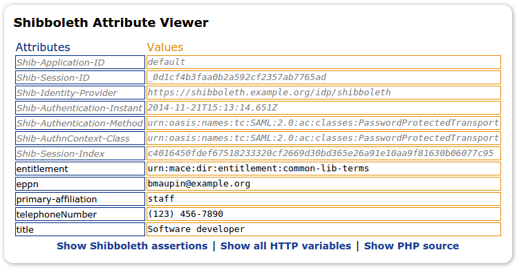
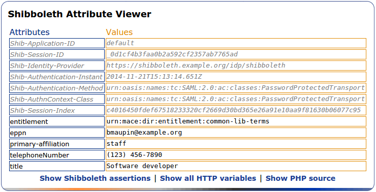

shibboleth-attribute-viewer
===========================

Shibboleth attribute viewers based on the old SWITCH attribute viewer:

- switch-viewer
  - The old SWITCH attribute viewer from https://aai-viewer.switch.ch/viewer.php?source as well as the referenced images
- viewer-no-images
  - Based on the original SWITCH viewer with the SWITCH branding and images removed. Looks like this:
    
- viewer-with-images
  - Based on the original SWITCH viewer with the SWITCH branding removed but the original colorful border intact. Looks like this:
    
